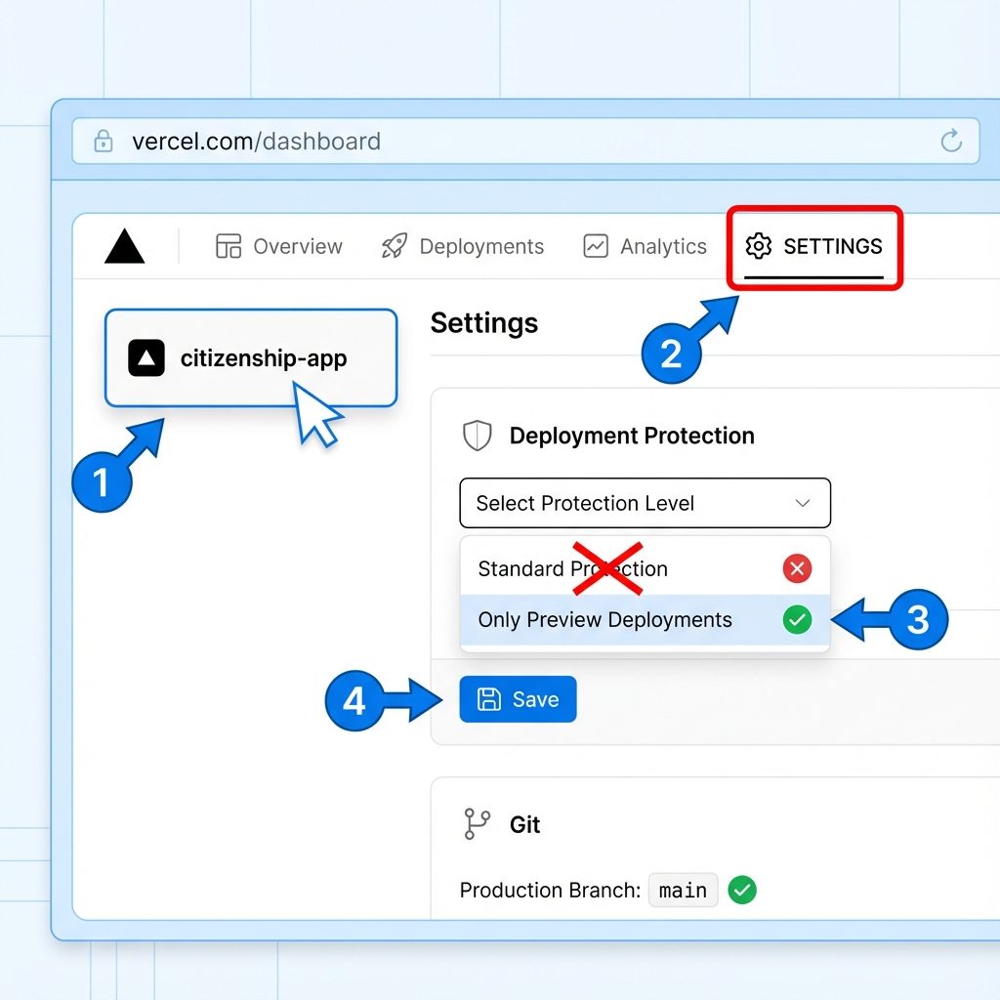
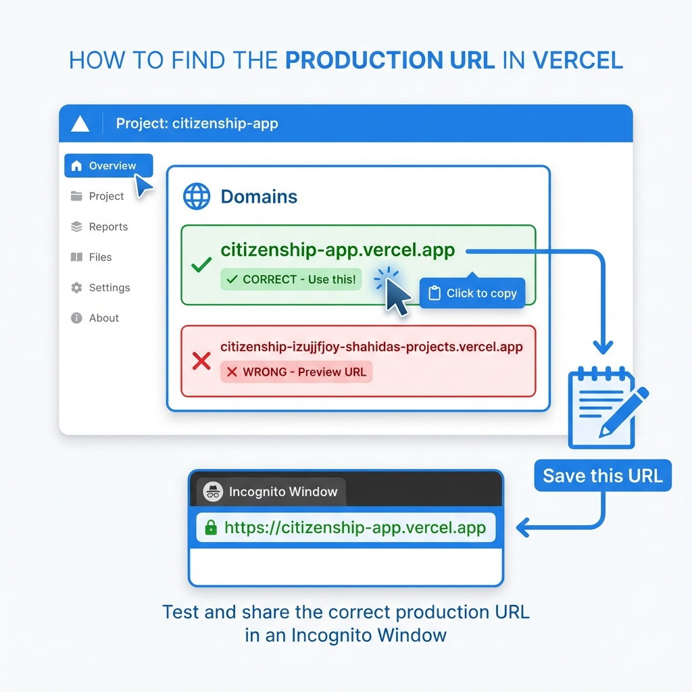

# 📸 Visual Guide - Vercel Setup Steps 2-4

This guide shows you EXACTLY what to look for in your Vercel dashboard.

---

## 📋 Step 2: Fix Deployment Protection Settings

### What to Do:

1. **Log in to Vercel**: https://vercel.com/dashboard
2. **Click on your "citizenship-app" project**
3. **Click the "Settings" tab**
4. **Find "Deployment Protection"** and change it
5. **Check "Production Branch"** is set to "main"

### Visual Guide:

**Follow the numbered steps in the image above:**
1. Click on your project
2. Click "Settings" tab
3. Find "Deployment Protection" section
4. Change to "Only Preview Deployments" or "Disabled"
5. Click "Save"
6. Verify "Production Branch" is "main"

---

## 🌐 Step 3: Get Your Production URL

### What to Do:

1. **Click "Overview" tab** (at the top)
2. **Look for "Domains" section**
3. **Find the CORRECT production URL** (clean URL without random characters)
4. **Copy that URL**

### Visual Guide:

**What to look for:**
- ✅ **CORRECT**: `citizenship-app.vercel.app` (clean, short URL)
- ❌ **WRONG**: `citizenship-izujjfjoy-shahidas-projects.vercel.app` (long URL with random characters)

**Copy the correct URL and save it!**

---

## 🧪 Step 4: Test Public Access

### What to Do:

1. **Open an incognito/private browser window**
   - Chrome/Edge: Press `Ctrl + Shift + N`
   - Firefox: Press `Ctrl + Shift + P`

2. **Paste your production URL** (the one you copied in Step 3)

3. **Press Enter**

4. **Check the result:**
   - ✅ **SUCCESS**: App loads, shows citizenship test homepage
   - ❌ **PROBLEM**: Asks you to log in to Vercel

---

## ✅ Success Checklist

After completing all steps, you should have:

- [ ] Changed Deployment Protection to "Only Preview Deployments" or "Disabled"
- [ ] Verified Production Branch is "main"
- [ ] Found your production URL (clean URL, not preview URL)
- [ ] Tested in incognito browser
- [ ] App loads without login ✅

---

## 🆘 Still Stuck?

**Tell me:**
1. Which step are you on? (2, 3, or 4)
2. What do you see on your screen?
3. Take a screenshot if possible

I'll help you figure it out! 🚀

---

## 📝 Quick Summary

| Step | What to Do | Where to Do It |
|------|------------|----------------|
| **Step 2** | Disable Deployment Protection | Vercel Dashboard → Settings |
| **Step 3** | Copy your production URL | Vercel Dashboard → Overview → Domains |
| **Step 4** | Test in incognito browser | Open incognito window, paste URL |

---

**Once you complete these steps, your app will be publicly accessible!** 🎉
